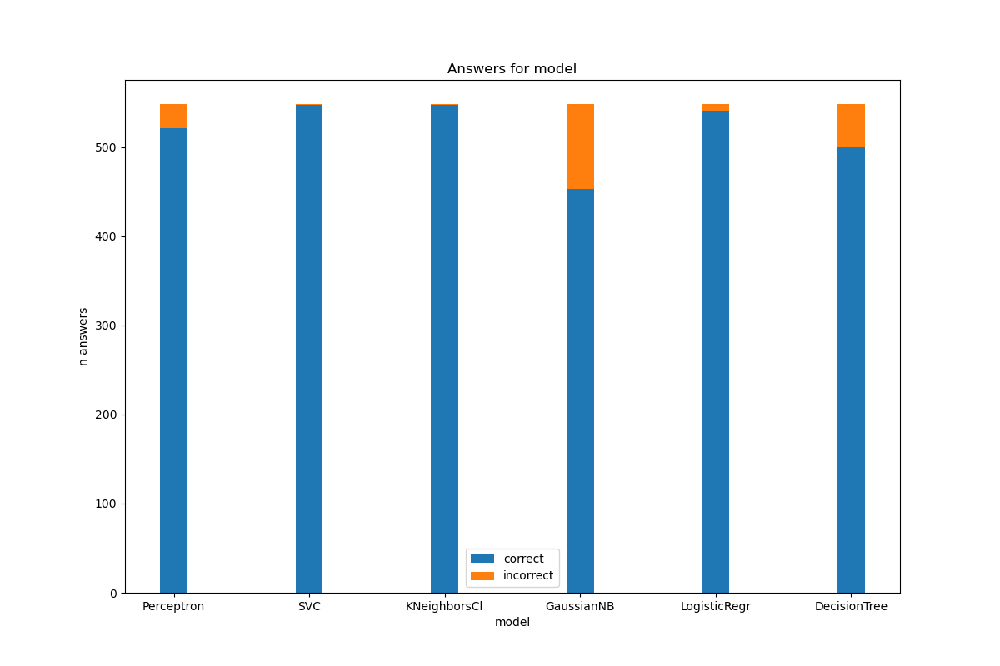
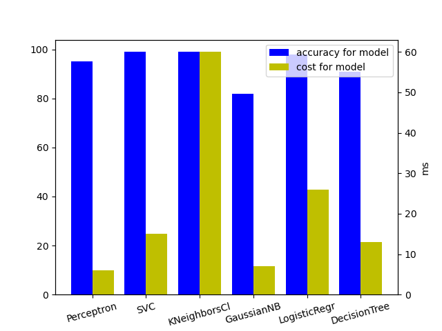

# banknotes-authentication

di Nicole Stolbovoi [MAT. 709168] e Luca Zeverino [MAT. 698710]

# Indice  

### 1. [Introduzione](#1)  

### 2. [Metodologia](#2)
 1. [Apprendimento supervisionato](#2.1)  
 2. [Tecniche di ML](#2.2)  
     2.1 [Support Vector Machine](#2.2.1)  
     2.2 [Perceptron](#2.2.2)  
     2.3 [Gaussian Naive Bayes](#2.2.3)  
     2.4 [KNearest Neighbors](#2.2.4)  
     2.5 [Logistic Regression](#2.2.5)  

### 3. [Modellazione](#3)          
 1. [Importazione delle librerie](#3.1)          
 2. [Caricamento dataset](#3.2)
 3. [Visualizzazione dei dati](#3.3)             
 4. [Divisione degli attributi](#3.4)             
 5. [Separazione del dataset](#3.5)
 6. [Addestramento sul training set](#3.6)             
 7. [Predizione sul testing set](#3.7)             
 8. [Valutazione delle prestazioni](#3.8)             

### 4. [Conclusioni](#4)

# <span id = "1">1. Introduzione</span>
<p align="justify">Negli Stati Uniti c'è circa una banconota contraffatta ogni 10.000 banconote autentiche. Da quando negli ultimi anni è stato lanciato il servizio di deposito diretto in contanti ai bancomat, le banconote contraffatte sono diventate un problema non solo per i commercianti, ma anche per le banche. Sebbene siano quasi impossibili da identificare ad occhio nudo, l'elaborazione delle immagini è un metodo che può essere utilizzato per individuare le discrepanze nelle banconote contraffatte.</p>
<p align="justify">Dato un set di dati di oltre mille banconote con 4 attributi ciascuno, possiamo utilizzare modelli di apprendimento automatico come la regressione logistica e K-neirest neighbors per addestrare un'IA per classificare le banconote.</p>
<p align="justify">Le immagini sono state tratte da banconote autentiche e contraffatte (n=1372). Ci sono quattro attributi in questo set di dati: varianza dell'immagine trasformata Wavelet (WTI), asimmetria del WTI, curvatura del WTI, entropia dell'immagine. L'ultima colonna è la classificazione della banconota (dove il valore 0 è falso e 1 è autentico). In matematica, una serie wavelet è una rappresentazione di una funzione di integrale quadrato (con valori reali o complessi) per determinate serie ortonormali generate da una wavelet.</p>
<p><a href="#top">Torna all'inizio</a>

# <span id = "2">2. Metodologia</span>
<p align="justify">I modelli sperimentali sono stati configurati utilizzando il metodo <code>holdout</code>. Questo metodo separa il dataset in due sottoinsiemi (rapporto 60:40) chiamati training set e testing set. Il training set viene utilizzato per addestrare il classificatore mentre il testing set viene utilizzato per stimare il tasso di errore del classificatore addestrato.

## <span id = "2.1">2.1. Apprendimento supervisionato</span>
<p align="justify">L'apprendimento supervisionato è una tecnica di apprendimento automatico che mira a istruire un sistema informatico in modo da consentirgli di predire i valori di output di un sistema rispetto ad un input sulla base di una serie di esempi, costituiti da coppie di input e di output, che gli vengono inizialmente forniti. L'obiettivo è quindi predire i valori delle caratteristiche di output dalle caratteristiche di input.

<p align="justify">Una caratteristica è una funzione da esempi in un valore. Il dominio di una caratteristica è l'insieme di valori che può restituire.

<p align="justify">In un task di apprendimento supervisionato, al sistema è dato

  - una serie di funzioni di input
  - una serie di caratteristiche target
  - una serie di esempi di addestramento, in cui vengono forniti i valori per le caratteristiche di input e le                 caratteristiche di output per ciascun esempio, e
  - una serie di esempi di test, in cui vengono forniti solo i valori per le caratteristiche di input.

## <span id = "2.2">2.2. Tecniche di ML</span>

### <span id = "2.2.1">2.2.1 Support Vector Machine</span>
<p align="justify">Le macchine a vettori di supporto (SVM, dall'inglese Support Vector Machines) sono dei modelli di apprendimento supervisionato associati ad algoritmi di apprendimento per la regressione e la classificazione. Dato un insieme di esempi per l'addestramento, ognuno dei quali etichettato con la classe di appartenenza fra le due possibili classi, un algoritmo di addestramento per le SVM costruisce un modello che assegna i nuovi esempi a una delle due classi, ottenendo quindi un classificatore lineare binario non probabilistico. Un modello SVM è una rappresentazione degli esempi come punti nello spazio, mappati in modo tale che gli esempi appartenenti alle due diverse categorie siano chiaramente separati da uno spazio il più possibile ampio. I nuovi esempi sono quindi mappati nello stesso spazio e la predizione della categoria alla quale appartengono viene fatta sulla base del lato nel quale ricade.
 
I vantaggi delle macchine a vettore di supporto sono: 
 - Efficace in spazi ad alta dimensione. 
 - Efficace nei casi in cui il numero di dimensioni è maggiore del numero di campioni. 

<p align="justify">Utilizza un sottoinsieme di punti di addestramento nella funzione decisionale (chiamati vettori di supporto), quindi è anche efficiente in termini di memoria.
 
Gli svantaggi delle macchine vettoriali di supporto includono: 
 - Se il numero di funzionalità è molto maggiore del numero di campioni, evitare un adattamento eccessivo nella scelta delle funzioni del kernel e il termine di regolarizzazione è   fondamentale. 

SVC è una classe in grado di eseguire la classificazione binaria e multiclasse su un dataset.
 
### <span id = "2.2.2">2.2.2 Perceptron</span>
<p align="justify">Il Perceptron è un altro algoritmo di classificazione supervisionato di classificatori binari adatto per l'apprendimento su larga scala. Un classificatore binario è una funzione che può decidere se un input, rappresentato da un vettore di numeri, appartiene o meno a una classe specifica. È un tipo di classificatore lineare, ovvero un algoritmo di classificazione che effettua le sue previsioni sulla base di una funzione predittrice lineare che combina un insieme di pesi con il vettore delle caratteristiche.

### <span id = "2.2.3">2.2.3 Gaussian Naive Bayes</span>
<p align="justify">I metodi Naive Bayes sono un insieme di algoritmi di apprendimento supervisionato basati sull'applicazione del teorema di Bayes con l'assunzione "ingenua" dell'indipendenza condizionale tra ogni coppia di caratteristiche dato il valore della variabile di classe.

<p align="justify">Nonostante i loro presupposti semplificati, i classificatori naive di Bayes hanno funzionato abbastanza bene in molte situazioni del mondo reale, notoriamente la classificazione dei documenti e il filtraggio dello spam. Richiedono una piccola quantità di dati di addestramento per stimare i parametri necessari. I learner e i classificatori di Naive Bayes possono essere estremamente veloci rispetto a metodi più sofisticati. Il disaccoppiamento delle distribuzioni delle caratteristiche condizionali di classe significa che ciascuna distribuzione può essere stimata in modo indipendente come una distribuzione unidimensionale. D'altra parte, sebbene il Naive Bayes sia noto come un classificatore discreto, è noto per essere un cattivo stimatore, quindi i risultati di probabilità non devono essere presi troppo sul serio.

`GaussianNB` implementa l'algoritmo Gaussian Naive Bayes per la classificazione.

### <span id = "2.2.4">2.2.4 KNearest Neighbors</span>
<p align="justify">Il principio alla base dei metodi del vicino più vicino è trovare un numero predefinito di campioni di addestramento più vicini alla distanza al nuovo punto e prevedere l'etichetta da questi. Il numero di campioni può essere una costante definita dall'utente (apprendimento del vicino più vicino k) o variare in base alla densità locale dei punti (apprendimento del vicino più vicino basato sul raggio). La distanza può, in generale, essere qualsiasi misura metrica: la distanza euclidea standard è la scelta più comune. I metodi basati sui vicini sono noti come metodi di apprendimento automatico non generalizzanti, poiché semplicemente "ricordano" tutti i suoi dati di addestramento (possibilmente trasformati in una struttura di indicizzazione veloce come un albero a sfere o un albero di KD). Nonostante la sua semplicità, i vicini più vicini hanno avuto successo in un gran numero di problemi di classificazione e regressione. Essendo un metodo non parametrico, ha spesso successo in situazioni di classificazione in cui il confine decisionale è molto irregolare.

<p align="justify">La classificazione basata sui vicini è un tipo di apprendimento basato su istanze o apprendimento non generalizzante: non tenta di costruire un modello interno generale, ma memorizza semplicemente istanze dei dati di addestramento. La classificazione è calcolata da un voto a maggioranza semplice dei vicini più vicini di ciascun punto: a un punto di interrogazione viene assegnata la classe di dati che ha il maggior numero di rappresentanti all'interno dei vicini più vicini del punto. scikit-learn implementa due diversi classificatori dei vicini più vicini: KNeighborsClassifier implementa l'apprendimento basato sui vicini più vicini di ciascun punto di query, dove è un valore intero specificato dall'utente. La classificazione -neighbors in KNeighborsClassifier è la tecnica più comunemente usata. La scelta ottimale del valore è fortemente dipendente dai dati: in generale un valore più grande sopprime gli effetti del rumore, ma rende meno distinti i confini della classificazione. 

<p align="justify">Gli svantaggi di questa classificazione è che è abbastanza lento dover attraversare e misurare la distanza tra un punto e ognuno di questi punti vicini. Ma ci sono modi per cercare di aggirarlo. Esistono strutture di dati che possono aiutare a rendere più rapidamente possibile trovare i vicini.
 
Un modo per determinare la classe di una banconota sconosciuta è confrontarla con banconote che abbiano variabili simili. K è il numero di confronti utilizzati per predire la banconota sconosciuta. Valutiamo i dati con K=1 e risulta molto efficace! KNN con K=1 ha classificato le banconote con una precisione del 100%. Il modello di apprendimento automatico funziona meglio a valori bassi di K, all'aumentare di K diminuisce anche l'accuratezza.

### <span id = "2.2.5">2.2.5 Logistic Regression</span>
<p align="justify">La regressione logistica, nonostante il suo nome, è un modello lineare per la classificazione piuttosto che la regressione. In questo modello, le probabilità che descrivono i possibili esiti di una singola prova sono modellate utilizzando una funzione logistica.
 
Questa divide i dati in due parti. Per visualizzare come funziona, tracciamo i primi due attributi. Le regioni della trama in verde mostrano un'alta probabilità di essere autentiche; il magenta mostra un'alta probabilità di essere contraffatto. I punti dati nella regione bianca hanno una probabilità del 50-50 di essere autentici.
 
Il modello di regressione logistica predice l'autenticità delle banconote con elevata precisione. 
 


<p><a href="#top">Torna all'inizio</a>

# <span id = "3">3.Modellazione e analisi</span>

## <span id = "3.1">3.1 Importazione librerie</span>
Il seguente script viene utilizzato per importare i moduli Python:

```
import csv
import random
import sys
import pprint
import time
import numpy as np
import pandas as pd
import matplotlib.pyplot as plt


from tabulate import tabulate
from numpy import *
```

<p align="justify">Sono stati utilizzati gli algoritmi: Support Vector Machines, K Nearest Neighbor (1), Perceptron Learning, Gaussian Naive Bayes e logistic Regression, i cinque più comuni per i problemi di classificazione dell'apprendimento automatico:

```
from sklearn import svm
from sklearn.linear_model import Perceptron
from sklearn.naive_bayes import GaussianNB
from sklearn.neighbors import KNeighborsClassifier
from sklearn.linear_model import LogisticRegression

︙

for x in range(5):

    if x == 0:
        model = Perceptron()
    if x == 1:
        model = svm.SVC()
    if x == 2:
        model = KNeighborsClassifier(n_neighbors=1)
    if x == 3:
        model = GaussianNB()
    if x == 4:
        model = LogisticRegression()
```

<p align="justify">Si noti che dopo aver importato gli algoritmi, possiamo scegliere quale modello utilizzare. Il resto del codice rimarrà lo stesso.</p>

## <span id = "3.2">3.2 Caricamento dataset</span>  
<p align="justify">Una volta importate le librerie, il passaggio successivo consiste nel caricare il dataset nella nostra applicazione. Quindi apriamo il file con le funzionalità di base del file python e utilizziamo la funzione <code>csv.reader()</code> del modulo csv, che legge il dataset nel formato CSV.</p>

```
# Read data from file
with open("banknotes.csv") as f:
    reader = csv.reader(f)
    next(reader)
```
## <span id = "3.3">3.3 Visualizzazione dei dati</span>
Per capire meglio i dati si traccia un grafico della distribuzione di ciascuno degli attributi


Di seguito sono riportati grafici a dispersione di banconote autentiche in verde e banconote false in rosso. Notare il netto contrasto nella trama di sinistra e la quasi indistinguibilità nell'altra. Questa osservazione ci dice che l'IA farà più affidamento su quella di sinistra per le informazioni rispetto a quella di destra.


## <span id = "3.4">3.4 Divisione degli attributi</span>  
<p align="justify">In questo dataset, varianza, inclinazione, curvatura ed entropia sono caratteristiche mentre la colonna della classe contiene l'etichetta. Lo script seguente, insieme alla parte sopra menzionata, divide i dati in evidenze e etichette. Quindi archivia le evidenze e l'etichetta in una elenco <code>data = []</code>.  

```
    data = []
    for row in reader:
        # print(row)
        data.append({
            "evidence": [float(cell) for cell in row[:4]],
            "label": "Authentic" if row[4] == "0" else "Counterfeit",
            # green Authentic - red Counterfeit
            "color": (1, 0, 0) if row[4] == "0" else (0, 1, 0),
            "class": row[4]
```

<p align="justify">Il ciclo <code>for</code> è l'indice che vogliamo filtrare dal nostro dataset, nella riga <code>"evidence": [float(cell) for cell in row[:4]]</code> filtriamo dalla colonna 0 alla colonna 3 che contiene l'insieme degli attributi evidenti. Nella riga <code>"label": "Authentic" if row[4] == "0" else "Counterfeit"</code>, abbiamo filtrato solo i record dalla colonna quattro che contiene le etichette (classe). Se l'etichetta è 0, la banconota è autentica e quando l'etichetta è 1, la banconota è contraffatta/falsa.</p>  

## <span id = "3.5">3.5 Separazione del dataset</span>
<p align="justify">Il training set viene utilizzato per addestrare gli algoritmi di apprendimento automatico mentre il testing set viene utilizzato per valutare le prestazioni degli algoritmi di apprendimento automatico.

```
# Separate data into training and testing groups
holdout = int(0.40 * len(data)) # prende 40% del dataset
random.shuffle(data) # mischia dati
testing = data[:holdout]
training = data[holdout:]
```

<p align="justify">Innanzitutto, calcoliamo la lunghezza dell'elenco di dati in <code>holdout = int(0.40 * len(data))</code> e mescoliamo gli elementi dei dati per prestazioni migliori utilizzando la funzione <code>random.shuffle()</code> dal modulo random. Quindi memorizziamo il 40% dei dati nel gruppo testing e il 60% dei dati nel gruppo training.</p>

## <span id = "3.6">3.6 Addestramento sul training set</span>
<p align="justify">Il set di evidenze di training viene archiviato come <code>X_training</code> (input), mentre il set di etichette di training viene archiviato come <code>y_training</code> (output), quindi passato al metodo <code>fit()</code>.

```
    # Train model on training set
    X_training = [row["evidence"] for row in training]
    y_training = [row["label"] for row in training]
    model.fit(X_training, y_training)
```

## <span id = "3.7">3.7 Predizione sul testing set</span>
<p align="justify">Dopo aver addestrato l'algoritmo, abbiamo eseguito previsioni sul set di test. Per fare previsioni, viene utilizzato il metodo <code>predict()</code>. I record da prevedere vengono passati come parametri al metodo <code>predict()</code> come mostrato di seguito:

```
    # Make predictions on the testing set
    X_testing = [row["evidence"] for row in testing]
    y_testing = [row["label"] for row in testing]
    predictions = model.predict(X_testing)
```

## <span id = "3.8">3.8 Valutazione delle prestazioni</span>
Abbiamo valutato le prestazioni del modello attraverso un semplice codice Python:

```
    # Compute how well we performed
    correct = 0
    incorrect = 0
    total = 0
    for actual, predicted in zip(y_testing, predictions):
        total += 1
        if actual == predicted:
            correct += 1
        else:
            incorrect += 1
```

e infine stampiamo l'accuratezza del modello per migliorarne la comprensione:

```
    res[x+1][0] = type(model).__name__
    res[x+1][1] = correct
    res[x+1][2] = incorrect
    res[x+1][3] = f"{100 * correct / total:.2f}"
    res[x+1][4] = f"{time.process_time() - t:.4f}"

print (tabulate(res[1:], headers=res[0]))
```

<p><a href="#top">Torna all'inizio</a>

# <span id = "4">4. Conclusioni</span>
<p align="justify">In questo progetto abbiamo spiegato come abbiamo risolto il problema dell'autenticazione delle banconote utilizzando tecniche di machine learning. Abbiamo confrontato quattro diversi algoritmi in termini di prestazioni e abbiamo concluso che gli algoritmi KNN e SVM sono i migliori algoritmi per l'autenticazione delle banconote con una precisione del 100% e del 99,64%.</p>

```
Model           Correct    Incorrect    Accuracy (%)    Cost (ms)
------------  ---------  -----------  --------------  -----------
Perceptron          542            6           98.91            7
SVC                 546            2           99.64           16
KNeighborsCl        548            0          100              62
GaussianNB          465           83           84.85            6
LogisticRegr        543            5           99.09           24
```

Per maggior leggibilità possiamo vedere le risposte corrette e incorrette degli algoritmi in questo grafico:

<p align="justify">In conclusione è importante valutare anche il costo di questi algoritmi in quanto migliori performance si traducono in costi computazionali maggiori e quindi lentezza.
 


<p><a href="#top">Torna all'inizio</a>
